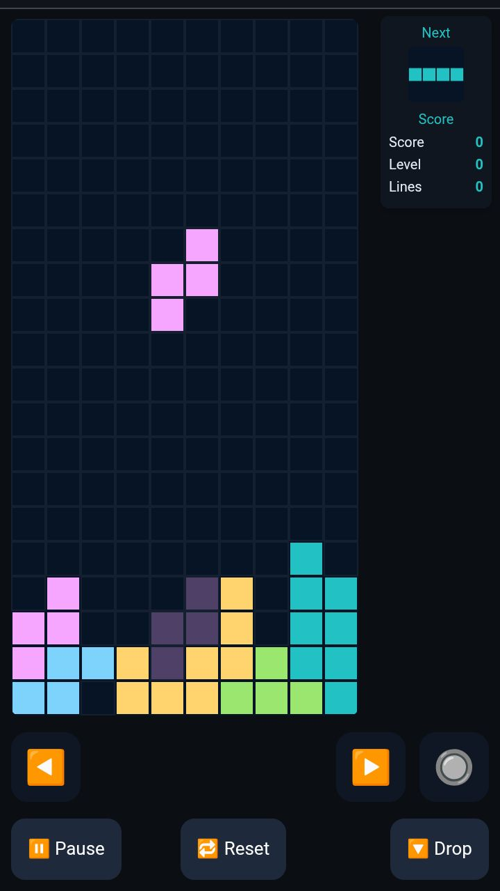
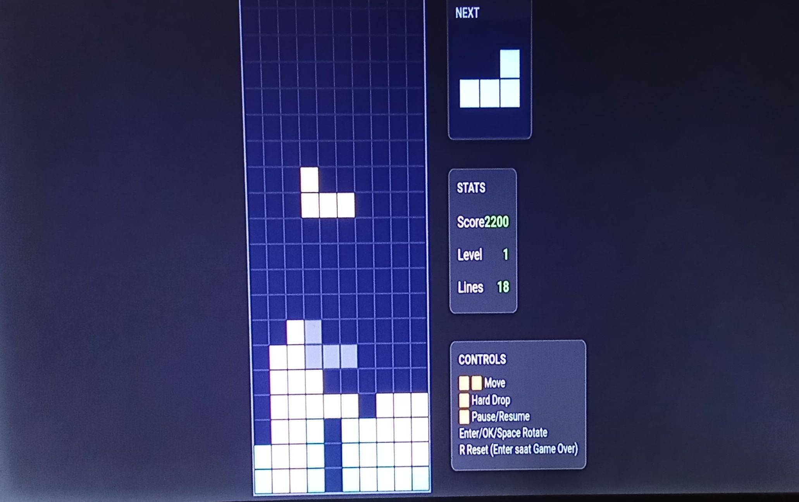

# 🎮 Blockdrop

Game ringan berbasis terminal yang ditulis dalam Python dan C++.
Silakan pilih salah satu versi sesuai kenyamanan anda.

Mainkan Blockdrop langsung di Browser kesayangan anda. Sambil bernostalgia masa kecil anda 😁.

---

## Mobile Version

Versi Mobile untuk pengguna Smartphone. Dilengkapi dengan tombol virtual:

▶️ = Kanan

◀️ = Kiri

🔽 = Hard Drop / Turun Cepat

🔘 = Rotate / Putar

🔁 = Reset Game

⏹️ = Pause



### Luncurkan Game Versi Mobile:

Klik tautan dibawah ini untuk meluncurkan game versi mobile:

[👉👉👉 Blockdrop Mobile Version](
https://rovikin.github.io/blockdrop/)

## Desktop Version

Versi Desktop untuk pengguna PC / Laptop. Versi ini bisa diakses dan dikontrol hanya menggunakan keyboard fisik atau D-pad pada stick game (jika ada).

⬆️ = Pause

⬇️ = Hard Drop / Turun Cepat

➡️ = Kanan

⬅️ = Kiri

🆗 / Enter = Rotate / Putar



### Luncurkan Game Versi Desktop:

Untuk meluncurkan game versi desktop silahkan klik tautan dibawah ini:

[👉👉👉 Blockdrop Desktop Version](https://rovikin.github.io/blockdrop-desktop/)

---

## 🧪 Instalasi

Instalasi ini hanya menampilkan panduan penginstalan versi CLI

### ▶️ Python
```bash
pkg update && pkg upgrade -y
pkg install python git
git clone https://github.com/Rovikin/blockdrop.git
cd blockdrop/py/
python blockdrop.py
```

### 💻 C++
```bash
pkg update && pkg upgrade -y
pkg install git clang make ncurses
git clone https://github.com/Rovikin/blockdrop.git
cd blockdrop/cpp/
g++ blockdrop.cpp -o blockdrop -lncurses
./blockdrop
```

### 🎮 Panduan Kontrol untuk versi CLI

Gunakan kursor keyboard anda:

| Tombol | Fungsi            |
|--------|-------------------|
| ↑      | Rotasi blok       |
| ↓      | Hard drop         |
| ← / →  | Geser kiri / kanan|
| Spasi  | Hard drop         |
| P      | Pause / Unpause   |
| Q      | Keluar dari game  |

---

## Jalankan Offline

Game ini bisa anda jalankan secara lokal. Silahkan ikuti panduan dibawah ini. Anda bisa modifikasi sesuka anda untuk mendapatkan pengalaman terbaik.

### Mobile Version

#### python (Mobile)

```
pkg update && pkg upgrade -y
pkg install git python
git clone https://github.com/Rovikin/blockdrop.git
cd blockdrop
python -m http.server 8089
```

#### Python (Desktop)

```
pkg update && pkg upgrade -y
pkg install git python
git clone https://github.com/Rovikin/blockdrop-desktop.git
cd blockdrop-desktop
python -m http.server 8089
```

#### NodeJS (Mobile)

```
pkg update && pkg upgrade -y
pkg install git nodejs
git clone https://github.com/Rovikin/blockdrop.git
cd blockdrop
npm install -g http-server
http-server
```

#### NodeJS (Desktop)

```
pkg update && pkg upgrade -y
pkg install git nodejs
git clone https://github.com/Rovikin/blockdrop-desktop.git
cd blockdrop-desktop l
npm install -g http-server
http-server
```

---
